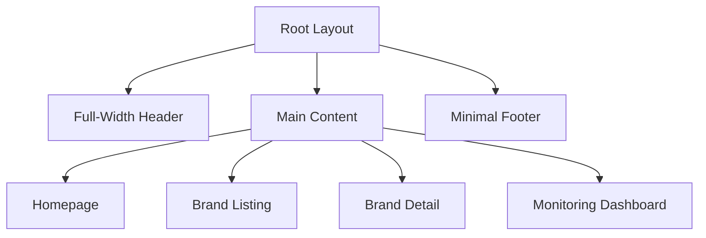
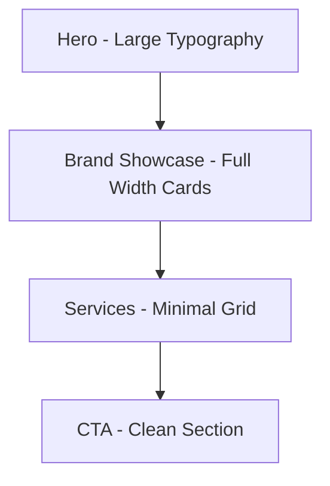
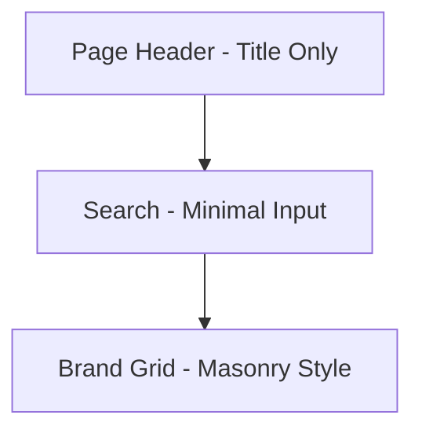
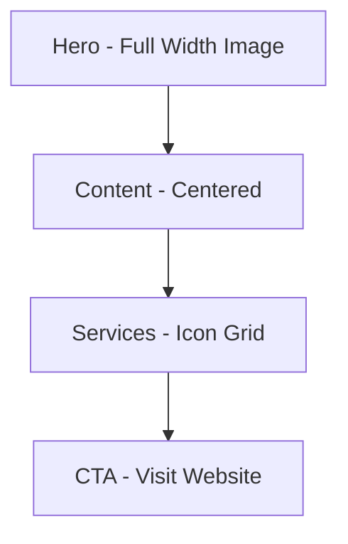
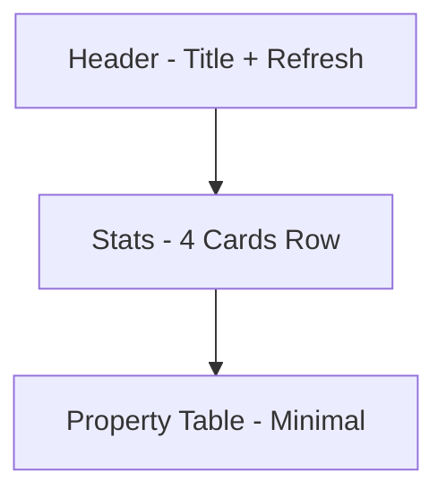

# UI/UX Design System & Architecture

## Hans Republic Corporate Portfolio

**Version**: 2.0 | **Date**: 2026-03-06 | **Design Direction**: Premium Minimal

---

## 1. Design Foundation

### 1.1 Design Philosophy

Premium minimal aesthetic with clean, sophisticated design:

- **Minimalism**: Generous whitespace, clean lines, focused content
- **Premium Feel**: Subtle gradients, refined typography, smooth interactions
- **Content First**: Large imagery, generous padding, uncluttered layouts
- **Motion**: Fluid, purposeful animations that enhance rather than distract

### 1.2 Color Palette

```css
:root {
  /* Base - Pure Black & White */
  --color-black: #000000;
  --color-white: #ffffff;

  /* Grays - Refined scale */
  --color-gray-50: #fafafa;
  --color-gray-100: #f5f5f5;
  --color-gray-200: #e5e5e5;
  --color-gray-300: #d4d4d4;
  --color-gray-400: #a3a3a3;
  --color-gray-500: #737373;
  --color-gray-600: #525252;
  --color-gray-700: #404040;
  --color-gray-800: #262626;
  --color-gray-900: #171717;

  /* Primary - Refined Blue */
  --color-primary: #0071e3;
  --color-primary-hover: #0077ed;
  --color-primary-light: #e5f2ff;

  /* Accent */
  --color-accent-blue: #2997ff;
  --color-accent-green: #30d158;
  --color-accent-orange: #ff9f0a;
  --color-accent-red: #ff375f;

  /* Status Colors */
  --color-status-online: #30d158;
  --color-status-offline: #ff375f;
  --color-status-unknown: #86868b;

  /* Background */
  --color-bg-primary: #ffffff;
  --color-bg-secondary: #f5f5f7;
  --color-bg-tertiary: #1d1d1f;

  /* Text */
  --color-text-primary: #1d1d1f;
  --color-text-secondary: #86868b;
  --color-text-tertiary: #6e6e73;
  --color-text-inverse: #f5f5f7;

  /* Borders */
  --color-border: #d2d2d7;
  --color-border-light: #e5e5e5;
}
```

### 1.3 Typography

```css
:root {
  /* Font Family - System fonts */
  --font-family:
    -apple-system, BlinkMacSystemFont, "Segoe UI", "Helvetica Neue", sans-serif;

  /* Font Sizes - Large, impactful scale */
  --font-size-xs: 0.75rem; /* 12px */
  --font-size-sm: 0.875rem; /* 14px */
  --font-size-base: 1rem; /* 16px */
  --font-size-lg: 1.125rem; /* 18px */
  --font-size-xl: 1.25rem; /* 20px */
  --font-size-2xl: 1.5rem; /* 24px */
  --font-size-3xl: 1.875rem; /* 30px */
  --font-size-4xl: 2.25rem; /* 36px */
  --font-size-5xl: 3rem; /* 48px */
  --font-size-6xl: 3.75rem; /* 60px */
  --font-size-7xl: 4.5rem; /* 72px */

  /* Font Weights */
  --font-weight-normal: 400;
  --font-weight-medium: 500;
  --font-weight-semibold: 600;
  --font-weight-bold: 700;

  /* Letter Spacing - Tighter for headlines */
  --letter-spacing-tight: -0.02em;
  --letter-spacing-normal: 0;
  --letter-spacing-wide: 0.02em;
}
```

### 1.4 Spacing System

```css
:root {
  --spacing-0: 0;
  --spacing-1: 0.25rem; /* 4px */
  --spacing-2: 0.5rem; /* 8px */
  --spacing-3: 0.75rem; /* 12px */
  --spacing-4: 1rem; /* 16px */
  --spacing-5: 1.25rem; /* 20px */
  --spacing-6: 1.5rem; /* 24px */
  --spacing-8: 2rem; /* 32px */
  --spacing-10: 2.5rem; /* 40px */
  --spacing-12: 3rem; /* 48px */
  --spacing-16: 4rem; /* 64px */
  --spacing-20: 5rem; /* 80px */
  --spacing-24: 6rem; /* 96px */
  --spacing-32: 8rem; /* 128px */
  --spacing-40: 10rem; /* 160px */
}
```

### 1.5 Responsive Breakpoints

```css
:root {
  --breakpoint-sm: 744px;
  --breakpoint-md: 768px;
  --breakpoint-lg: 1024px;
  --breakpoint-xl: 1280px;
  --breakpoint-2xl: 1440px;
}
```

### 1.6 Shadows

```css
:root {
  --shadow-sm: 0 1px 2px rgba(0, 0, 0, 0.05);
  --shadow-md: 0 4px 6px -1px rgba(0, 0, 0, 0.1);
  --shadow-lg: 0 10px 15px -3px rgba(0, 0, 0, 0.1);
  --shadow-xl: 0 20px 25px -5px rgba(0, 0, 0, 0.1);
  --shadow-2xl: 0 25px 50px -12px rgba(0, 0, 0, 0.25);
}
```

### 1.7 Border Radius

```css
:root {
  --radius-sm: 0.375rem; /* 6px */
  --radius-md: 0.5rem; /* 8px */
  --radius-lg: 0.75rem; /* 12px */
  --radius-xl: 1rem; /* 16px */
  --radius-2xl: 1.5rem; /* 24px */
  --radius-3xl: 2rem; /* 32px */
  --radius-full: 9999px;
}
```

---

## 2. Layout Architecture

### 2.1 Page Structure



### 2.2 Global Layout

**Header (Sticky)**

- Height: 56px (desktop and mobile)
- Blur background effect (backdrop-filter)
- Centered logo with navigation
- Transparent becoming solid on scroll

**Main Content**

- Full-width sections with generous vertical spacing
- Max-width: 980px centered for content
- Padding: 20px (mobile), 48px (desktop)

**Footer**

- Simple, minimal single-column
- Background: var(--color-bg-tertiary)
- Muted text on dark background

---

## 3. Page Designs

### 3.1 Homepage Layout



**Hero Section**

- Full viewport height (100vh)
- Centered headline (var(--font-size-7xl) desktop, var(--font-size-4xl) mobile)
- Subtle gradient background (optional)
- Single primary CTA button
- Scroll indicator at bottom

**Brand Showcase Section**

- Section title: Large, bold typography
- Full-width cards with large imagery
- Horizontal scroll on mobile, grid on desktop
- Each card: Full-bleed image, overlay text, subtle parallax

**Services Overview**

- 5-column grid, icon + short text
- Minimal, almost grid-like display
- Generous padding between items

**Contact CTA**

- Centered, single column
- Clean background color (var(--color-bg-secondary))

### 3.2 Brand Listing Page



**Search & Filter Bar**

- Minimal search input, bottom border only
- Filter as pill buttons below search
- No visual clutter

**Brand Grid**

- Masonry-style or large card grid
- 3 columns desktop, 2 columns tablet, 1 column mobile
- Large imagery, minimal text overlay

### 3.3 Brand Detail Page



**Hero**

- Full-width hero image (60vh)
- Brand name overlaid, bottom-left
- Subtle gradient overlay for text readability

**Content**

- Single column, max-width 800px
- Generous line-height (1.8)
- Minimal heading hierarchy

**Services**

- Simple list with icons
- No cards, just clean rows

**External Links**

- Single prominent button
- "Learn more" or "Visit website"

### 3.4 Monitoring Dashboard



**Dashboard Header**

- Page title left, refresh button right
- Last updated timestamp small

**Summary Stats Cards**

- 4 cards in a row
- Large number, small label
- Subtle background (var(--color-bg-secondary))
- Status color accent (green/red/gray dot)

**Property List Table**

- Minimal table design
- Alternating row backgrounds
- Status dot indicator
- Clean, readable typography

---

## 4. Component Specifications

### 4.1 Button

```typescript
interface ButtonProps {
  variant: "primary" | "secondary" | "plain";
  size: "sm" | "md" | "lg";
  children: React.ReactNode;
  onClick?: () => void;
  disabled?: boolean;
}
```

**Variants**

- Primary: Solid blue (#0071e3), white text, rounded-full
- Secondary: Gray background, dark text
- Plain: No background, blue text

**Sizes**

- sm: 32px height, 12px 20px padding
- md: 40px height, 16px 24px padding
- lg: 48px height, 20px 32px padding

**Style**

- Border-radius: 9999px (pill shape)
- No visible border
- Subtle shadow on hover

### 4.2 BrandCard

```typescript
interface BrandCardProps {
  brand: Brand;
  onClick?: () => void;
}
```

**Structure**

```
┌─────────────────────────────────────────┐
│                                         │
│          [Full-Width Image]             │
│                                         │
├─────────────────────────────────────────┤
│  Brand Name                             │
│  Tagline                                │
│                                         │
│  [Service] [Service]                    │
└─────────────────────────────────────────┘
```

**Specs**

- Aspect ratio: 4:3 or 16:9 for image
- Padding: 24px
- No visible border
- Subtle hover lift (transform: translateY(-4px))
- Box-shadow on hover only

### 4.3 ServiceCategoryBadge

```typescript
interface ServiceCategoryBadgeProps {
  category: ServiceCategory;
  size?: "sm" | "md";
}
```

**Style**

- Pill shape (border-radius: 9999px)
- Small text (12px)
- Light background, darker text
- Minimal, almost tag-like

### 4.4 PropertyStatusBadge

```typescript
interface PropertyStatusBadgeProps {
  status: "online" | "offline" | "unknown";
  showLabel?: boolean;
}
```

**Style**

- Small dot indicator (8px circle)
- Color: green/red/gray
- Label in muted text

### 4.5 SearchInput

```typescript
interface SearchInputProps {
  value: string;
  onChange: (value: string) => void;
  placeholder?: string;
}
```

**Style**

- No border, bottom border only
- Large, comfortable padding
- Placeholder text in gray
- Clear button as "×" icon

### 4.6 PropertyList (Table)

```typescript
interface PropertyListProps {
  properties: DigitalProperty[];
  onRowClick?: (property: DigitalProperty) => void;
}
```

**Style**

- Minimal table, no vertical borders
- Header in uppercase, small, muted
- Row hover highlight (subtle gray)
- Status as colored dot

---

## 5. Responsive Breakpoint Strategy

### 5.1 Fluid Typography

```css
/* Hero headline */
font-size: clamp(2.5rem, 5vw, 4.5rem);

/* Section titles */
font-size: clamp(2rem, 4vw, 3rem);

/* Body text */
font-size: clamp(1rem, 1.5vw, 1.125rem);
```

### 5.2 Breakpoints

| Breakpoint | Width    | Layout        |
| ---------- | -------- | ------------- |
| default    | < 744px  | Single column |
| sm         | ≥ 744px  | Two columns   |
| md         | ≥ 768px  | Three columns |
| lg         | ≥ 1024px | Full layout   |
| xl         | ≥ 1280px | Max content   |

### 5.3 Spacing Scale (Fluid)

```css
/* Section padding */
padding-block: clamp(3rem, 8vw, 8rem);

/* Component gaps */
gap: clamp(1rem, 3vw, 2rem);
```

---

## 6. Interaction Patterns

### 6.1 Hover States

| Element | Hover Behavior                  |
| ------- | ------------------------------- |
| Buttons | Background darken, slight scale |
| Cards   | Subtle lift, shadow appears     |
| Links   | Underline slides in             |
| Images  | Subtle scale (1.02)             |

### 6.2 Focus States

```css
*:focus-visible {
  outline: 2px solid var(--color-primary);
  outline-offset: 4px;
  border-radius: 4px;
}
```

### 6.3 Animations

```css
:root {
  --duration-instant: 0ms;
  --duration-fast: 150ms;
  --duration-normal: 300ms;
  --duration-slow: 500ms;
  --duration-slower: 800ms;

  --ease-out: cubic-bezier(0.16, 1, 0.3, 1);
  --ease-in-out: cubic-bezier(0.65, 0, 0.35, 1);
}
```

**Animation Examples**

- Page load: Fade up, 500ms ease-out, staggered
- Card hover: Transform 300ms var(--ease-out)
- Button: Background 150ms, scale 100ms
- Modal: Fade + scale 300ms var(--ease-out)

### 6.4 Scroll Animations

```css
/* Fade in on scroll */
@keyframes fadeInUp {
  from {
    opacity: 0;
    transform: translateY(20px);
  }
  to {
    opacity: 1;
    transform: translateY(0);
  }
}

/* Apply with Intersection Observer */
.animate-on-scroll {
  animation: fadeInUp 600ms var(--ease-out) forwards;
  opacity: 0;
}
```

### 6.5 Loading States

- Skeleton: Subtle pulse animation, light gray
- Spinner: Single circle, not multiple
- Progress: Thin bar at top of viewport

---

## 7. Accessibility Guidelines

### 7.1 Color Contrast

- Text: minimum 4.5:1
- Large text: minimum 3:1
- UI components: minimum 3:1

### 7.2 Focus Indicators

- Visible focus ring on all interactive elements
- Custom outline in brand color

### 7.3 Reduced Motion

```css
@media (prefers-reduced-motion: reduce) {
  *,
  *::before,
  *::after {
    animation-duration: 0.01ms !important;
    animation-iteration-count: 1 !important;
    transition-duration: 0.01ms !important;
  }
}
```

### 7.4 Touch Targets

- Minimum: 44x44px
- Comfortable: 48x48px

---

## 8. Component Architecture

```
src/
├── app/
│   ├── layout.tsx
│   ├── page.tsx              # Homepage
│   ├── brands/
│   │   ├── page.tsx         # Brand listing
│   │   └── [slug]/
│   │       └── page.tsx     # Brand detail
│   ├── monitoring/
│   │   └── page.tsx         # Monitoring dashboard
│   └── api/
│       └── monitoring/
│           └── route.ts
│
├── components/
│   ├── ui/
│   │   ├── Button.tsx
│   │   ├── Input.tsx
│   │   ├── Badge.tsx
│   │   ├── Card.tsx
│   │   └── Skeleton.tsx
│   │
│   ├── layout/
│   │   ├── Header.tsx
│   │   ├── Footer.tsx
│   │   └── Section.tsx
│   │
│   ├── brands/
│   │   ├── BrandCard.tsx
│   │   ├── BrandList.tsx
│   │   ├── BrandHero.tsx
│   │   └── ServiceBadge.tsx
│   │
│   └── monitoring/
│       ├── StatusCard.tsx
│       ├── PropertyTable.tsx
│       └── RefreshButton.tsx
│
├── lib/
│   ├── config/
│   ├── types/
│   └── utils/
│
├── data/
│   ├── brands.json
│   └── properties.yaml
│
└── styles/
    └── globals.css
```

---

## 9. Visual Guidelines Summary

### Typography

- Headlines: Bold, tight letter-spacing
- Body: Regular weight, comfortable line-height (1.6-1.8)
- Use system fonts for performance

### Colors

- Primary: #0071e3 (refined blue)
- Background: White and light gray (#f5f5f7)
- Text: Near-black (#1d1d1f) and gray (#86868b)

### Spacing

- Generous vertical rhythm
- 48-96px between sections
- 24-32px within components

### Imagery

- High quality, professional photos
- Full-width hero images
- Subtle rounded corners

### Motion

- Smooth, 300ms standard
- Fade and slide for page transitions
- Parallax for hero sections

---

## 10. Acceptance Criteria

### Design System

- [ ] All color tokens defined and accessible
- [ ] Typography scale implemented with fluid sizing
- [ ] Spacing system follows generous rhythm
- [ ] Component variants documented

### Pages

- [ ] Homepage hero with large typography
- [ ] Brand showcase with full-width cards
- [ ] Brand listing with minimal search
- [ ] Monitoring dashboard with clean table

### Components

- [ ] Pill-shaped buttons
- [ ] Cards with hover lift effect
- [ ] Status badges with dot indicators
- [ ] Smooth scroll animations

### Accessibility

- [ ] Color contrast meets WCAG AA
- [ ] Keyboard navigation works
- [ ] Reduced motion respected
- [ ] Touch targets 44px minimum
